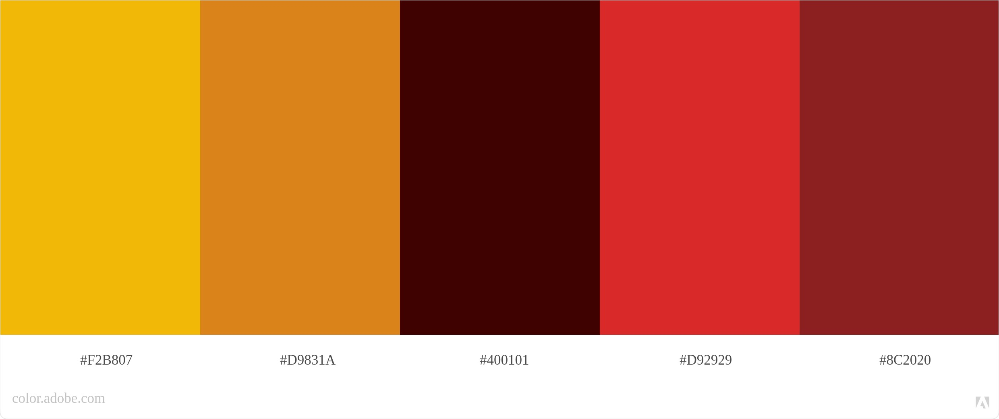
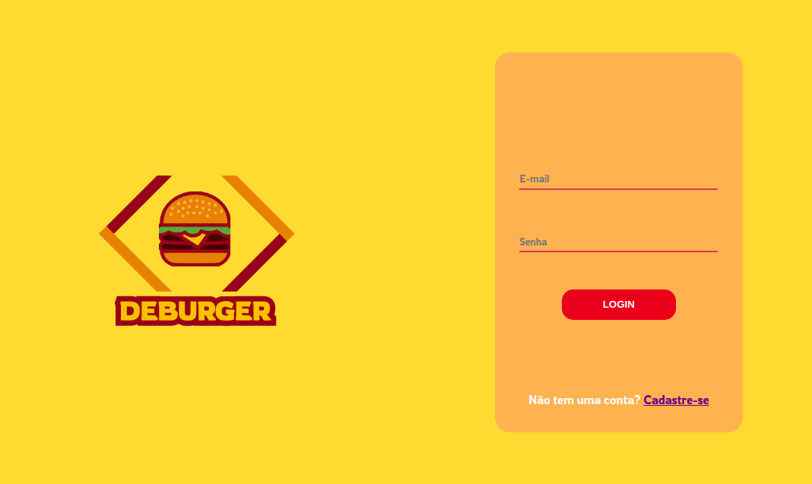

# <Deburguer>

## 4º projeto - Burger Queen Front-end desenvolvido no bootcamp SAP006 da [Laboratória](https://www.laboratoria.la/br) 

## Índice

1. [Definição do Produto](#dart-definição-do-produto)
2. [Histórias de Usuários](#pencil2-histórias-de-usuários)
3. [Protótipos](#art-protótipos)
4. [Como Utilizar](#gear-como-utilizar)
5. [Tecnologias Utilizadas](#robot-tecnologias-utilizadas)
6. [Estrutura dos Principais Arquivos](#file_folder-estrutura-dos-principais-arquivos)
7. [Sobre as desenvolvedoras](#woman_technologist-sobre-as-desenvolvedoras)

---
## 💻 Definição do Produto

Olá! Somos o [Deburguer](https://divino-burger.vercel.app/), um fast food originado de duas desenvolvedoras web aposentadas. Nosso comércio tem feito sucesso entre os amantes da tecnologia e por isso precisamos de um sistema que facilite o gerencimento de pedidos.

Nós temos 2 menus: 

Café da manhã:

| Item                           | Preço R$ |
| ------------------------------ | -------- |
| Café americano                 | 5        |
| Café com leite                 | 7        |
| Sanduíche de presunto e queijo | 10       |
| Suco de fruta natural          | 7        |

Qualquer horário do dia:

| Item                     | Preço  |
| ------------------------ | ------ |
| **Hambúrgueres**         | **R$** |
| Hambúrguer simples       | 10     |
| Hambúrguer duplo         | 15     |
| **Acompanhamentos**      | **R$** |
| Batata frita             | 5      |
| Anéis de cebola          | 5      |
| **Bebidas**              | **R$** |
| Água 500ml               | 5      |
| Água 750ml               | 7      |
| Bebida gaseificada 500ml | 7      |
| Bebida gaseificada 750ml | 10     |


Nossos clientes são bastante indecisos, por isso é muito comum que eles mudem o
seu pedido várias vezes antes de finalizar.

A interface deve mostrar os dois menus (café da manhã e restante do dia), cada
um com todos os seus _produtos_. O usuário (atendentes) deve poder escolher que _produtos_
adicionar e a interface deve mostrar o _resumo do pedido_ com o custo total.

Os pedidos serão enviados por meio de um _tablet_, mas não queremos um aplicativo nativo, mas sim um aplicativo Web que seja mobile-first.


O objetivo principal é aprender a construir uma _interface web_ usando o
_framework_ escolhido (React). Esse framework front-end ataca
o seguinte problema: **como manter a interface e estado sincronizados**.
Portanto, esta experiência espera familiarizá-la com o conceito de _estado da
tela_, e como cada mudança no estado vai refletir na interface (por exemplo,
toda vez que adicionamos um _produto_ para um _pedido_, a interface deve
atualizar a lista de pedidos e o total).

---

<div style="display: flex">
  
</div>

<br>

<div>
 
  <h4> Você pode acessar a aplicação utilizando um dos logins de teste abaixo:</h4>
 
  <h4> Você pode acessar a aplicação utilizando um dos logins de teste abaixo:</h4>


| #                     	|             Salão            	|                   	|
|:-----------------------:|:----------------------------:	|:---------------------------:	|
| 🆔	| testedeburguer@testedeburguer.com 	| 
| key                 	|            123456            	|

</div>

---
## 📃 Histórias de Usuários

**Historia de usuário 1:**  
Garçom/Garçonete deve poder entrar no sistema, caso o admin já lhe tenha dado as credenciais.
E como garçom/garçonete quero entrar no sistema de pedidos.

**Historia de usuário 2:**  
Garçom/Garçonete deve ser capaz de anotar pedido do cliente
Eu como garçom/garçonete quero poder anotar o pedido de um cliente para não depender da minha memória, saber quanto cobrar e poder enviar os pedidos para a cozinha para serem preparados em ordem.

**Historia de usuário 3:**  
Chefe de cozinha deve ver os pedidos.
Eu como chefe de cozinha quero ver os pedidos dos clientes em ordem, poder marcar que estão prontos e poder notificar os garçons/garçonetes que o pedido está pronto para ser entregue ao cliente.

**Historia de usuário 4:**  
Eu como garçom/garçonete quero ver os pedidos que estão prontos para entregá-los rapidamente aos clientes.

---

## 💡 Protótipos 

### Paleta de Cores 
<div align="center" style="display: flex">
  
</div>

---

<div align="center" style="display: flex">
  

</div>

---
## Como Utilizar

- A tela inicial da aplicação traz a **Página de Login** que apresenta ao usário as opções de fazer o login com email e senha já cadastrados e entrar na plataforma do Deburguer ou prosseguir para a Página de Cadastro;
- Na **Página de Cadastro**, o funcionário pode cadastrar-se inserindo seus dados de Nome, E-mail, Senha e Setor de Trabalho;
- Ao realizar qualquer uma dessas formas de acesso, o usuário será encaminhado para o seu respectivo ambiente:
    1. **Salão**: para os garçons/garçonetes, onde ocorrerá a anotação e encaminhamento dos pedidos para a cozinha;
    2. **Cozinha**: para os cozinheiros que receberão a demanda dos pedidos realizados.
    3. **Pedidos**: para os garçons/garçonetes, onde ocorrerá a exibição de pedidos finalizados para serem entregues e um histórico de pedidos já entregues


---
## 🚀 Tecnologias Utilizadas
<br>

 

 Linguagem de marcação 

  

 Linguagem de estilização

 

Linguagem de programação interpretada estrutura

 

Bibioteca do Javascript que auxilia na criação de interface

 

 Software de execução de códigos JavaScript

  

 Sistemas de controle de versões distribuídos

 

 Editor gráfico de vetor e prototipagem de projetos


---

## Estrutura dos Principais Arquivos
```
.
├── 📁public
|
├── 📁src
|   ├── 📁components
|   |   ├── 📁Button
|   |   ├── 📁Cards
|   |   ├── 📁Cart
|   |   ├── 📁Header
|   |   ├── 📁Input
|   |   ├── 📁Menu
|   |   ├── 📁Order
|   |   ├── 📁ValidationMessage
|   |
|   ├── 📁img
|   |
|   ├── 📁pages
|   |   ├── 📁Hall
|   |   ├── 📁Kitchen
|   |   ├── 📁Login
|   |   |── 📁Pedidos
|   |   └── 📁Register
|   |
|   |
|   ├── 📄Index.css
|   ├── 📄Index.js
|   └── 📄PrivateRoute.js
|   └── 📄SetupTests.js
|
├── 📄README.md
└── 📄package.json
```


---

## ✔️ Resultados

* #### Desktop


* #### Tablet


---
## 👩‍💻 Colaboradoras 


<table>
  <tr>
      <td align="center">
            <a href="#">
            <br>
            <sub>
            <b>Bruna Calixto</b><br>
            </sub>
            </a>
      </td>
    <td align="center">
      <a href="#">
        <br>
        <sub>
          <b>Sabrina Araújo</b><br>
        </sub>
      </a>
    </td>
   
  </tr>
</table>

<table width="300">
      <td>
            <a href="https://github.com/bruna-devbio/">
            <a href="https://www.linkedin.com/in/brunacalixtodevjunior/">
      </td>
      <td>
            <a href="https://github.com/sabrinaaraujo-ds">
            <a href="https://www.linkedin.com/in/sabrina-araujo-ds/">
      </td>

</table>


